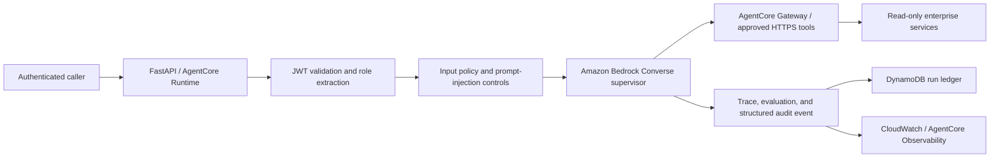

# AgentForge Control Plane


A production-grade multi-agent control plane for secure operational workflows. AgentForge uses a real Amazon Bedrock Converse agent loop in production, verifies caller identity, authorizes every tool invocation, persists execution records, emits structured audit telemetry, and evaluates every run.

It is engineered to run locally for contract testing and to deploy to Amazon Bedrock AgentCore once an AWS account, model access, identity provider, and approved tool targets are configured. This repository never claims an AWS deployment that has not actually been performed.

## Capabilities

- **Real model runtime:** production mode calls Amazon Bedrock through the Converse API, including bounded multi-turn tool use.
- **Secure identity boundary:** production requests require JWT verification; roles are derived from claims, never request bodies.
- **Governed tools:** tool contracts are allow-listed, role-gated, HTTPS-only in production, and suitable for AgentCore Gateway targets.
- **Persistent audit ledger:** runs are stored in DynamoDB with encrypted storage, TTL, and a newest-first operational index.
- **Fail-closed configuration:** the `/readyz` endpoint returns `503` until every production control is configured.
- **Observability and quality:** structured audit events, run traces, token accounting, deterministic safety gates, and a direct path to AgentCore Evaluations.
- **Secure delivery:** non-root container, Terraform foundation, least-privilege Runtime role, tests, and a production-readiness runbook.

## Architecture



## Runtime modes

| Mode | Model and tool behavior | Intended use |
| --- | --- | --- |
| `development` | Local contract fixtures; no cloud credentials or external actions. | Unit tests and UI development. |
| `production` | Real Bedrock Converse model, DynamoDB persistence, verified JWTs, and configured HTTPS tool targets. | Approved AWS deployment only. |

Production mode does not silently fall back to local behavior. Missing configuration causes `/readyz` to return `503`, and an invocation fails safely.

## Local development

```bash
python3 -m venv .venv
source .venv/bin/activate
python -m pip install -e ".[dev]"
uvicorn app.main:app --reload --port 8080
```

Open `http://127.0.0.1:8080` for the control-plane interface and `http://127.0.0.1:8080/docs` for the OpenAPI contract.

## Production configuration

Copy `.env.example` into your runtime environment or secret manager. `AGENTFORGE_RUNTIME_MODE=production` requires all of these categories:

1. `BEDROCK_MODEL_ID` and an IAM role permitted to invoke the enabled model.
2. `AGENTFORGE_RUN_STORE=dynamodb` and `AGENTFORGE_RUN_TABLE`.
3. JWT issuer, audience, and role claim configuration.
4. Four approved HTTPS tool URLs, normally AgentCore Gateway targets.

Do not store credentials in `.env`, source control, or browser-accessible configuration. Use IAM workload roles and AgentCore Identity for cloud and third-party credentials.

## Infrastructure and deployment

Terraform provisions the durable foundation:

```bash
cd infra/terraform
cp terraform.tfvars.example terraform.tfvars
terraform init
terraform plan
terraform apply
```

It creates an encrypted DynamoDB run ledger, CloudWatch log group, and an AgentCore Runtime execution role scoped to the account and Region. Pass the Terraform output values into the AgentCore deployment configuration. The exact deployment sequence and hardening controls are in [docs/agentcore-deployment.md](docs/agentcore-deployment.md) and [docs/runbooks/production-readiness.md](docs/runbooks/production-readiness.md).

AgentCore Runtime can host custom agents and AgentCore Gateway centralizes governed tool access. AWS documents the current [Runtime deployment flow](https://docs.aws.amazon.com/bedrock-agentcore/latest/devguide/runtime-get-started-cli.html), [Gateway](https://docs.aws.amazon.com/bedrock-agentcore/latest/devguide/gateway-using.html), [Identity](https://docs.aws.amazon.com/bedrock-agentcore/latest/devguide/identity.html), and [Observability](https://docs.aws.amazon.com/bedrock-agentcore/latest/devguide/observability.html).

## API

```bash
curl -s http://127.0.0.1:8080/api/runs \
  -X POST \
  -H 'content-type: application/json' \
  -d '{"question":"Investigate runtime latency incident","actor_role":"operator"}'
```

Production callers send a bearer token and must not send authority in the request body. The same service exposes `POST /invocations` and `GET /ping` for an AgentCore Runtime HTTP integration.

## Verification

```bash
python -m pytest -q
docker build -t agentforge-control-plane .
docker run --rm -p 8080:8080 agentforge-control-plane
```

Tests cover policy blocking, role boundaries, governed tool calls, the API contract, and Bedrock tool-loop behavior. The initial release corpus is in [evaluations/golden_dataset.jsonl](evaluations/golden_dataset.jsonl); use it with AgentCore Evaluations before every production promotion.

## Project layout

```text
app/                 API, JWT auth, Bedrock runtime, policies, persistence, telemetry
infra/terraform/     DynamoDB, CloudWatch, and least-privilege Runtime role
docs/runbooks/        Readiness and incident procedures
tests/               Unit and contract tests
```

## License

MIT. See [LICENSE](LICENSE).
