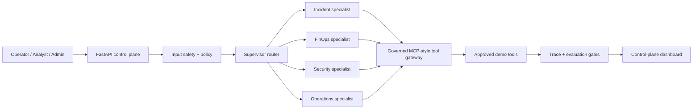

# AgentForge Control Plane


An end-to-end, safe-to-demo control plane for governed multi-agent operations. A supervisor selects a bounded specialist, every tool call passes a centralized policy gate, and every run is traced and evaluated before it can be considered successful.

This is a **local, deterministic demo**. It does not call a model, use production data, or create cloud infrastructure. It is designed to be easy to run during an interview or portfolio review, while preserving a deliberate path to Amazon Bedrock AgentCore.

## Why this project

Most agent demos stop at a chat interface. AgentForge demonstrates the operational capabilities enterprise teams need around an agent:

- Multi-agent routing for incident, FinOps, security, and operations workflows
- MCP-style tool registry with role-based, centralized authorization
- Prompt-injection detection before routing or tool execution
- Trace-level visibility into policy, supervisor, agent, and tool steps
- Automated evaluation gates for safety, groundedness, tool governance, and actionability
- A polished dashboard and an API suitable for integration testing

## Architecture



## Quick start

Prerequisite: Python 3.10 or later.

```bash
git clone https://github.com/YOUR_GITHUB_USERNAME/agentforge-control-plane.git
cd agentforge-control-plane
python3 -m venv .venv
source .venv/bin/activate
python -m pip install -e ".[dev]"
uvicorn app.main:app --reload --port 8080
```

Open `http://127.0.0.1:8080` to use the dashboard. API docs are available at `http://127.0.0.1:8080/docs`.

## Demo flow

Try these three requests from the dashboard:

| Request | Role | Expected behavior |
| --- | --- | --- |
| `Investigate runtime latency incident` | Operator | Incident agent calls health and runbook tools, then suggests a safe next action. |
| `What is our cloud spend forecast?` | Analyst | FinOps agent returns budget variance and a cost-control recommendation. |
| `Show access review status` | Admin | Security agent returns outstanding reviews without changing access. |

Use the same access request as an **Operator** to see authorization block the tool. Ask the system to ignore prior instructions to see the input policy block the request before any tool use.

## API example

```bash
curl -s http://127.0.0.1:8080/api/runs \
  -X POST \
  -H 'content-type: application/json' \
  -d '{"question":"Investigate runtime latency incident","actor_role":"operator"}'
```

For an AgentCore Runtime-style HTTP adapter, use `POST /invocations` with `{"prompt": "..."}`. The service also exposes `GET /ping`.

## Quality checks

```bash
python -m pytest -q
docker build -t agentforge-control-plane .
docker run --rm -p 8080:8080 agentforge-control-plane
```

The test suite covers the critical governance paths: incident tool use, prompt-injection blocking, and role boundary enforcement. GitHub Actions runs it on every pull request.

## AgentCore path

AgentCore Runtime is framework-agnostic and supports MCP and A2A, while Gateway provides a managed, unified entry point for agent tools. This project maps its local service boundaries to those AWS primitives, but only deploys after account, cost, and data decisions are explicitly made.

Read the deployment plan in [docs/agentcore-deployment.md](docs/agentcore-deployment.md). Current AWS references: [AgentCore overview](https://docs.aws.amazon.com/bedrock-agentcore/latest/devguide/), [Gateway](https://docs.aws.amazon.com/bedrock-agentcore/latest/devguide/gateway-using.html), [Evaluations](https://docs.aws.amazon.com/bedrock-agentcore/latest/devguide/evaluations.html), and [Observability](https://docs.aws.amazon.com/bedrock-agentcore/latest/devguide/observability.html).

## Repository layout

```text
app/                 FastAPI service, supervisor, policy, tools, evaluations
static/              Dashboard interface
tests/               Governance and execution tests
docs/                AWS AgentCore deployment and hardening plan
.github/workflows/   Continuous verification
```

## Next production steps

1. Replace demo tool responses with read-only Gateway targets.
2. Replace request-supplied roles with AgentCore Identity / OIDC claims.
3. Add OpenTelemetry and CloudWatch trace export.
4. Add a golden dataset to AgentCore Evaluations and gate deployment on score thresholds.
5. Introduce AgentCore Memory only after a data-retention and consent policy is approved.

## License

MIT. See [LICENSE](LICENSE).
